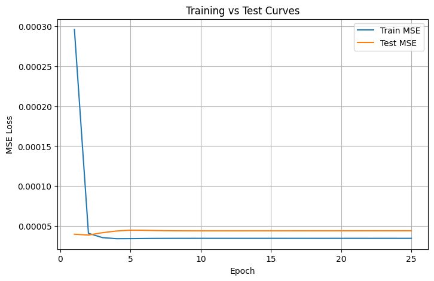
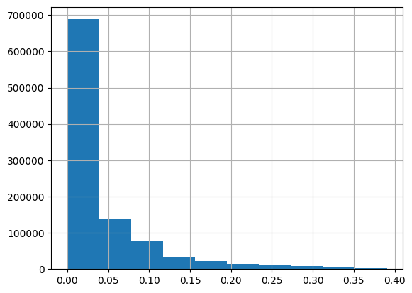
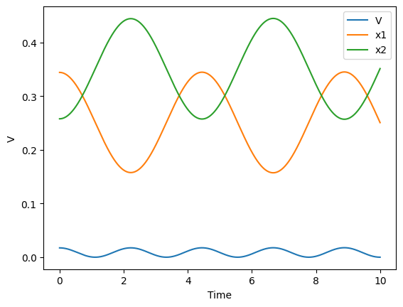
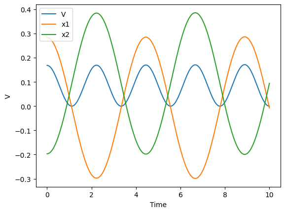

# **Behler–Parrinello Neural Network (BPNN) — PyTorch Implementation**

I built a **Behler–Parrinello Neural Network (BPNN)** from scratch in **PyTorch** to model **atomic potential energy surfaces** using **symmetry functions**.  
The network learns how local atomic environments contribute to the total energy of a molecule but at a fraction of the computational cost.

This project reproduces the architecture from *Behler & Parrinello (2007)* and includes:
- Computation of symmetry functions  
- A fully connected **atomic neural network** for per-atom energy prediction  
- **data generation** for a 2-particle system  
- End-to-end **training pipeline** and **energy surface visualization**  

---

## **Results**

### Neural Network Predictions
The following figures show how the trained BPNN captures the oscillatory energy patterns between two interacting particles over time.  
`x₁` and `x₂` represent the positions of the two particles, while `V` denotes the predicted potential energy.

| Neural Network Prediction 1 | Neural Network Prediction 2 |
|-------------------------------------|--------------------------------------|
|  |  |

---

### Data Breakdown
The dataset used for training consists of **~1 million data points**, each representing an atomic configuration and its corresponding potential energy.  
The distribution below shows the diversity of sampled configurations and the smooth physical behavior captured in the generated data.

| Data Distribution and Energy Sampling |
|--------------------------------------|

  
 

---

### Energy vs Particle Positions 

  
  

This highlights the relationship between motion and energy:  
- `x₁` and `x₂` oscillate out of phase, representing the two ends of a bonded system.  
- The energy `V` oscillates at twice the frequency, peaking when the system is maximally stretched or compressed.  

---

## **Project Overview**

The Behler–Parrinello approach decomposes the total molecular energy into **atomic contributions**, each computed by a small neural network that takes symmetry-based descriptors of the atom’s neighborhood as input.  
By using **radial** and **angular** symmetry functions, the model maintains **rotational, translational, and permutational invariance**, allowing it to generalize across different atomic configurations.

---

## **Data Generation**

Instead of relying on existing molecular datasets, I **generated all the data from scratch** to maintain complete control over the physics behind the system.  
The dataset represents a **two-particle molecular interaction**, where each data point corresponds to:
- Randomly sampled **interatomic distances**
- Computed **potential energies** using a physically realistic analytical potential (e.g., Lennard-Jones–like form)
- Normalized energy values for numerical stability during training  

All configurations and energies were stored in a CSV file (`simulation_data_2_particles.csv`), which the PyTorch `Dataset` class reads during training.

---

## **Implementation Highlights**

- **Framework:** PyTorch  
- **Visualization:** Matplotlib for learning curves and convergence plots  

 Link of my research report: [Chemistry AI Research Report](https://docs.google.com/document/d/1ZXNV-3CY-khu5GghFjfxN2H7nssL3GaRGjgMf3X_Zhs/edit?tab=t.0#heading=h.gjdgxs)
